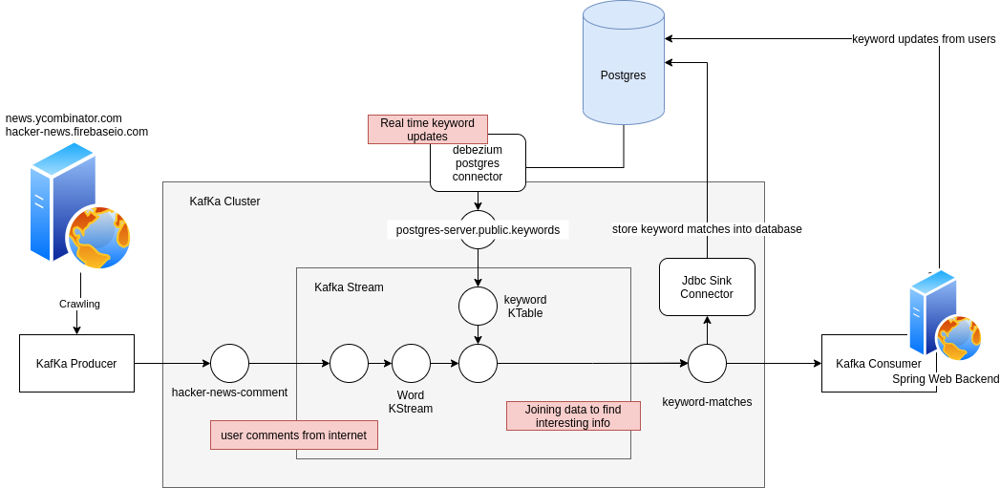
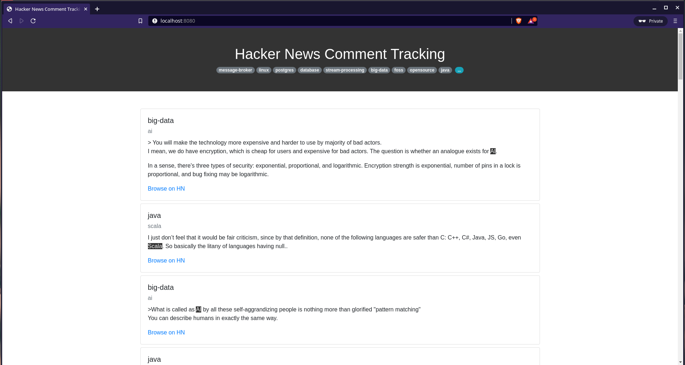
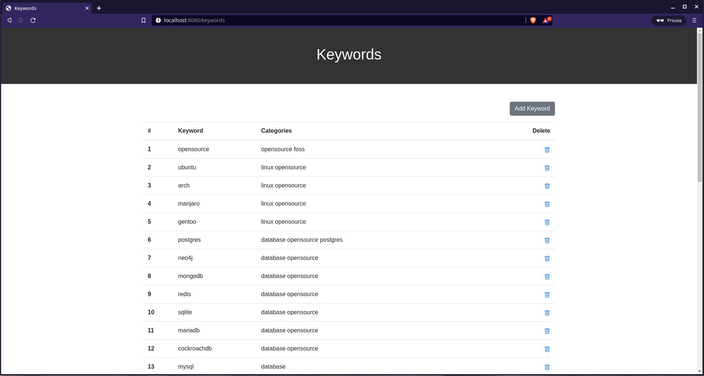

# Hacker News Comment Processing with Kafka



### Introduction

* 這個應用蒐集 Hacker News 用戶的留言內容，搭配使用者存於資料庫的關鍵字(keyword)，對留言內的關鍵字做標示。
* 利用 Debezium Connector for Postgres 對 Postgres 內的 Keyword Table 做動態資料捕捉(Change Data Capture, CDC)，Keyword 資料變動能無縫套用到 Kafka Stream KTable 內。
* Spring 網頁後端顯示資料

### Screenshots  





### Run Demo (From existing Docker Image on Github)

```shell
# Clone the project
git clone https://github.com/garyparrot/hackernews-comment-processing.git
cd hackernews-comment-processing

# launch docker-compose
cd ./demo-environment
docker-compose up

# visite the user interface
open http://localhost:8080
```

### Run Demo (Build everthing manually)

```shell
# Clone the project
git clone https://github.com/garyparrot/hackernews-comment-processing.git
cd hackernews-comment-processing

# Download connectors
sh ./dev-support/pg-data-connector/download-connector.sh
sh ./dev-support/pg-cdc-connector/download-connector.sh

# Bootstrap building environment (we need schema-registry otherwise we can't build)
cd dev-support
docker-compose up -d
cd ../

# Build
mvn clean package

# Start full environment
cd dev-support
docker-compose stop
docker-compose -f docker-compose.application.yaml -f docker-compose.yaml up

# visite the user interface
open http://localhost:8080
```

### Related Tools in this Project

* Kafka Producer
* Kafka Consumer
* Kafka Stream
* Kafka Connect
  * debezium posgres connector
  * Jdbc Sink Connector
* Confluent Schema Registry
* Docker
* Spring Framework
